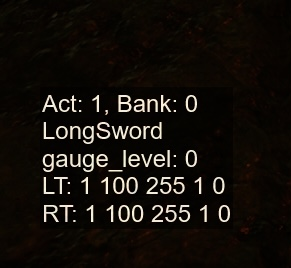

# 怪物猎人崛起飞智八爪鱼3手柄自定义自适应扳机

## 配置方式

使用 [JSON](https://www.w3cschool.cn/json/json-syntax.html) 和 [lua](https://www.w3cschool.cn/lua/) 文件组合作为配置文件，JSON 文件更简单，lua 文件更灵活。

## 配置文件位置

配置文件在怪猎安装目录下 `reframework/data/flydigi_apex/weapons` 内，每个武器可以有四个配置文件，`[WeaponName].lua`, `[WeaponName].json`, `[WeaponName].default.lua`, `[WeaponName].default.json`。一般用户修改`[WeaponName].json`即可，`default` 配置文件可能会随 mod 版本更新。配置文件生效的优先级按照如上顺序，最先匹配到的文件生效。文件不存在时则忽略此文件。`[WeaponName]` 是武器英文名，可在游戏内获取。`lua`配置文件请自行参考`default`配置文件修改。

## JSON 配置文件说明

首先需要你了解[基本的JSON语法](https://www.w3cschool.cn/json/json-syntax.html)

一个 JSON 文件内包含一个大的 JSON 对象，`actions` 字段是一个包含多个 `Action` 的列表， 每一个 `Action` 对应一种扳机设置的变化，以及此种扳机设置依据游戏内角色状态的匹配规则。当玩家在游戏内发动一个动作或状态发生变化时，会在 `actions` 列表内，自上而下依次判断是否匹配，第一个匹配到的 `Action` 会被应用。如果一个配置文件内的 `Action` 全都无法匹配，则自动选择优先顺序中的下一个配置文件进行匹配，如果所有配置文件都没有对应的匹配，则应用默认手柄设置。

下面是 `Action` 内的具体字段说明:

1. `name`: 当前 `Action` 的名字，可以作为在游戏内调试配置的参考
2. `trigger`: 此 `Action` 对应的扳机配置
3. `filters`: 此 `Action` 对应的匹配规则列表，只有当这个列表内的规则全部匹配时，才认为此 `Action` 匹配成功

### `trigger` 内字段的说明

`trigger` 是对应的扳机配置

1. `trigger`: 扳机位置，可选值 `"left"`, `"right"`, `null`, 如果为 `null` 或者不写此值，则两个扳机都生效
2. `mode`: 扳机模式，可选值 0, 1, 2, 3，分别对应飞智空间站内的四种扳机模式。特殊值: `default` 对应默认扳机配置，`current` 对应当前扳机配置
3. `params`: 这是一个四个数字组成的列表，对应飞智空间站内每种模式中的配置参数，当 `mode` 为特殊值时，此项会忽略
4. `duration`: 此扳机模式的生效时间，单位为秒，不写就是一直生效到被其他模式覆盖。一般需要扳机短暂震动时可以用这个值
5. `after`: 跟 `duration` 搭配使用，当 `duration` 时间过去后，要应用的扳机配置，支持的字段跟 `trigger` 内的字段相同，只有扳机位置的设置无法更改

### `filters` 内字段的说明

`filters` 是一个过滤器的列表，其中每一个过滤器均可以用来匹配游戏内的一个数值的状态，当所有过滤器都匹配成功时，认为此 `Action` 匹配成功。玩家在游戏内每一次状态的变动，都会触发一次整体的匹配尝试。

下面是每一个过滤器内的字段说明

1. `key`: 要匹配的游戏内的数值的名称，`action_id` 和 `action_bank_id` 是每一种武器都具有的 `key`，一般可以通过这两个值来判断现在角色正在执行什么动作。另外还有每个武器特有的状态数值(比如太刀的气刃等级，斩斧的觉醒状态)，这些可以通过游戏内的 `Debug Window` 来查看，后面会提到 `Debug Window` 的使用
2. `op`: 对于 `key` 对应的值，所要进行的比较操作。下面会具体说明不同的 `op` 所对应的操作
3. `value`: `op` 操作所比较的数值
4. `changed`: 是否只在此 `key` 对应的数值产生改变时才匹配，可选值 `true`, `false`
5. `prev`: 是否匹配此次状态变动前的数值，可选值 `true`, `false`，有一些动作通过变动前的值和当前的值做对比才能更好的匹配

#### 关于 `op` 操作的说明

| `op` |  说明  |  `value` 可选值  |
| ---- | ------ | --------------- |
| `=` |  等于 |  一个数字, 比如 `"value": 162` |
| `~=` | 不等于 | 一个数字 |
| `>` | 大于 | 一个数字 |
| `>=` |  大于或者等于 | 一个数字  |
| `<` | 小于 | 一个数字 |
| `<=` | 小于或者等于 | 一个数字 |
| `in` | 在 `value` 之中 | 多个数字组成的列表, 比如 `"value": [162, 163]` |
| `not in` | 不在 `value` 之中 | 多个数字组成的列表 | 

其中 `in` 和 `not in` 会比其他 `op` 更耗性能，请优先使用其他 `op`

对于在 `Debug Window` 中显示为 `true` 或 `false` 的 `key`， `op` 只支持 `=` 和 `~=`, 并且 `value` 只能写 `true` 或 `false`。

对于在 `Debug Window` 中显示为其他字符串的 `key`，`op` 只支持 `=` 和 `~=`, 并且 `value` 只能写字符串类型。

## 游戏内信息的获取

本 mod 提供了方便的工具来查看游戏内数值的变动情况，请在游戏内的设置中的mod设置内找到`飞智八爪鱼3`的设置，向下滚动，勾选 `Open Debug Window`，此设置不会保存，需要每次重启后手动开启。

打开 `Debug Window` 后，在进入训练场或者任务时，会在屏幕左下角显示当前人物状态的信息。

`Act:` 为当前动作对应的 `action_id`, `Bank: `为 `action_bank_id`。

当前武器的英文名称会显示在下一行。

武器名称下面会显示当前武器所特有的一些状态字段。

最下面 `LT` 和 `RT` 开头的两行，会显示当前两个扳机所对应的配置

## 编辑配置文件

打开 `Debug Window`, 进入训练场，拿起你喜爱的武器，这个时候可以看 `Debug Window` 记录下此武器的英文名，对应的 `reframework/data/flydigi_apex/weapons/[武器英文名].json` 即是此武器的配置文件。

在训练场内使用一些会按到 `LT` 或 `RT` 的招式，并记住 `action_id` 和 `action_bank_id` 所对应的数值，这些数字可以用来编写 `filters`

当你在配置文件中更改了内容后，可以在此mod的设置界面点击`重载武器配置`来使你的配置生效。

本 mod 附带的含有 `default` 后缀的配置文件可以用来参考，但请不要直接修改这些配置文件。

## Debug

如果你发现你的配置无法生效或者有其他问题产生，请打开 reframework 的设置界面（默认快捷键 `Insert`）, 
找到 `ScriptRunner`, 展开它，并点击 `Spawn Debug Window`，在弹出的窗口中查看有没有对应的报错信息。
